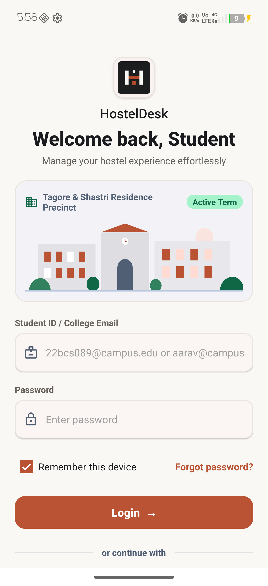
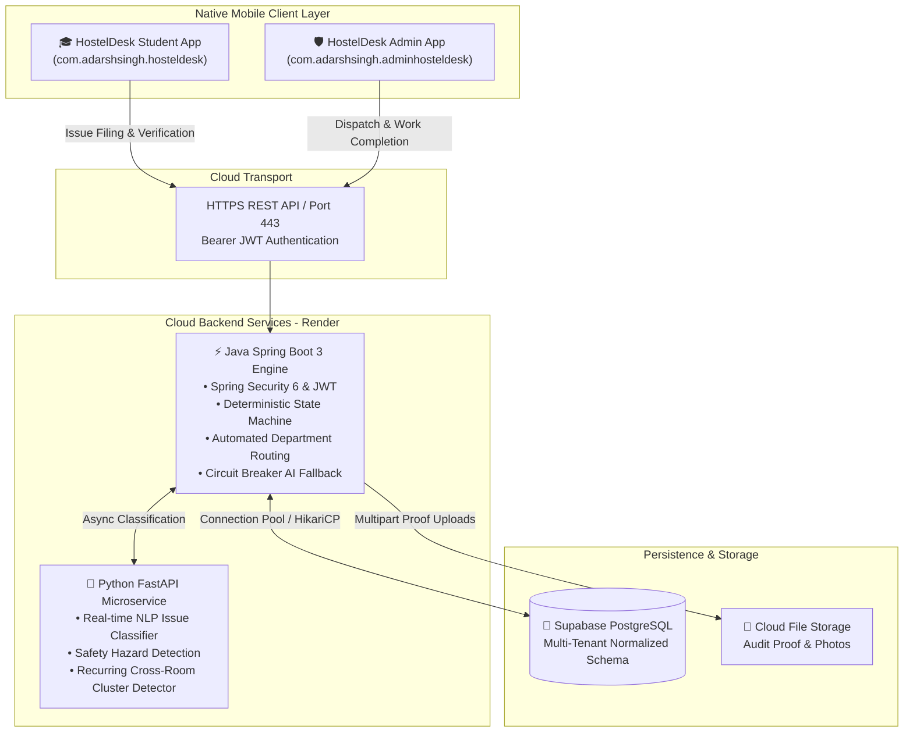
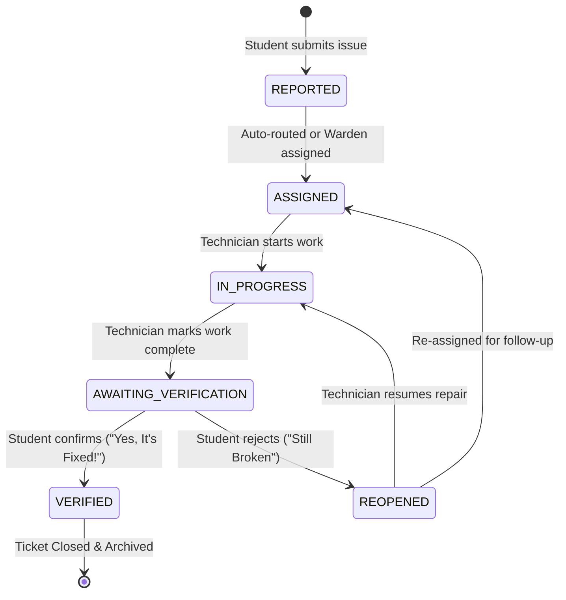

# HostelDesk 🏢⚡

> **Collegiate Housing Issue Management & Campus Residence Operations Platform**  
> *Engineered for Universities, Student Dormitories, and Campus Facility Management.*

[](https://developer.android.com)
[](https://www.oracle.com/java/)
[](https://spring.io/projects/spring-boot)
[](https://www.python.org/)
[](https://fastapi.tiangolo.com/)
[](https://supabase.com/)
[](https://github.com/adarsh0044321/HostelDesk/releases/tag/v1.5.0)
[](LICENSE)

---

## 📌 Executive Summary

Collegiate housing facilities regularly suffer from disorganized maintenance tracking: complaints are recorded on paper registers or scattered across informal messaging channels with zero accountability, leading to repeated structural failures, unverified repairs, and frustrated residents.

**HostelDesk** replaces these ad-hoc channels with an enterprise-grade, SLA-driven, multi-tenant ecosystem. It unites resident students, wardens, maintenance staff, and university leadership into a single cohesive platform powered by real-time notifications, photographic audit trails, deterministic lifecycle state machines, and intelligent AI issue categorization.

---

## 📱 Application Previews & Downloads

| HostelDesk Student App | HostelDesk Admin & Staff App |
| :---: | :---: |
|  |  |
| **For Resident Students** | **For Wardens, Staff & Directors** |
| [📥 Download Student APK (v1.5.0)](https://github.com/adarsh0044321/HostelDesk/releases/download/v1.5.0/HostelDesk-Student-v1.5.apk) | [📥 Download Admin APK (v1.5.0)](https://github.com/adarsh0044321/HostelDesk/releases/download/v1.5.0/HostelDesk-Admin-v1.5.apk) |

> 💡 **Release Assets**: The latest signed debug APK binaries are available directly on the **[GitHub Releases Page](https://github.com/adarsh0044321/HostelDesk/releases)**.

---

## 🏗️ System Architecture



---

## 🌟 Core System Modules

### 1. 🎓 Student Resident Android App (`student-android`)
- **Stitch Design Language**: Distinctive terracotta (`#BA5333`), clean off-white canvas (`#FAF8F5`), card surfaces, and responsive Material 3 layout.
- **Room Vitals & Announcements**: Real-time room status, emergency contacts, and hostel-wide bulletin updates.
- **AI-Assisted Issue Filing**: Real-time NLP categorization recommendation, safety hazard alert, and priority rating.
- **Camera & Proof Attachment**: Live camera capture via secure Android `FileProvider` with thumbnail previews.
- **Interactive Verification Loop**:
  - Once a technician marks work completed, residents receive a prompt to inspect their room.
  - **"Yes, It's Fixed!"**: Opens an inspection modal to award a 1–5 star rating and submit technician feedback.
  - **"No, Still Broken"**: Reopens the ticket with a specific reason, notifying the warden and technician immediately.
- **In-App Notification Stream**: Real-time notifications on ticket milestones (assigned, work started, resolved).

### 2. 🛡️ Admin, Warden & Staff Android App (`admin-android`)
- **Role-Adaptive Workspace**:
  - **Warden View**: Real-time Residence Health Pulse (e.g. 94% operational), attention-required escalation queues, department dispatch matrix, technician assignment.
  - **Maintenance Staff View**: Work order queues (`My Work`, `Dept Queue`, `Completed`), one-tap start work (`IN_PROGRESS`), and photographic proof upload on job completion.
  - **Executive Portal (4-Factor Authentication)**: Dedicated directors portal strictly isolated from operational warden logins, enforcing **Institute Code**, **Official ID**, **Password**, and a **6-Digit Secret Security PIN**.
- **Institution Registration & Provisioning**:
  - Direct institutional onboarding with custom or auto-generated 6-digit Executive Security PINs stored directly on the Institute entity.
- **Universal Multi-Status Filters**:
  - Live filtering across `Submitted`, `Assigned`, `In Progress`, `Resolved`, and `Closed` tabs.

### 3. ⚡ Java Spring Boot 3 Backend (`backend`)
- **Clean Modular Monolith**: Distinct layers for controllers, services, repositories, security, and exception handling.
- **Strict Multi-Tenant Isolation**: Every query and transaction is scoped by institute code, ensuring strict data boundaries between different colleges and universities.
- **Deterministic State Machine**: Strictly prevents illegal state transitions (e.g., tickets cannot skip from `REPORTED` to `VERIFIED` without passing through technician completion).
- **Circuit Breaker Routing**: Auto-routes categories to departments; if the Python AI microservice is offline, gracefully falls back to deterministic rule-based NLP classification without rejecting submissions.
- **Full Test Suite**: 16 unit and integration test suites covering isolation, state transitions, authentication, and routing.

### 4. 🤖 Python FastAPI AI Service (`ai-service`)
- **FastAPI Microservice**: Asynchronous, high-concurrency classification engine.
- **NLP Categorization**: Predicts maintenance departments (`PLUMBING`, `ELECTRICAL`, `CARPENTRY`, `CLEANING`, etc.) and priority scores with confidence percentages.
- **Recurring Issue Cluster Detector**: Analyzes spatial and category clusters to flag recurring structural failures across rooms.

---

## 🔄 Issue Lifecycle State Machine



---

## 🔐 Multi-Tenant & 4-Factor Executive Security

```
Operational Form (Warden / Staff)   ──► Rejects Institute Admins with HTTP 403
Executive Portal (Directors / Admins) ──► Requires 4 Mandatory Factors:
                                           1. Institute Code (e.g. JAI, NCH-001)
                                           2. Institutional Email or ID
                                           3. Master Account Password
                                           4. 6-Digit Executive Security PIN
```

- **Strict Boundary Enforcement**: Institute Administrators cannot log in through operational forms, and wardens cannot access the Executive Portal.
- **Stateless JWT Tokens**: Signed with HMAC-SHA256 containing user ID, role, hostel ID, and institute ID.
- **BCrypt Encryption**: Passwords hashed with salt strength 10.

---

## 📂 Repository Directory Structure

```text
HostelDesk/
├── admin-android/               # Native Android Admin & Staff Application (Java)
│   ├── app/src/main/java/       # Activities, Adapters, ViewModels, Retrofit Services
│   └── app/src/main/res/        # Material 3 Layouts, Drawables, Styles, Colors
├── student-android/             # Native Android Student Resident Application (Java)
│   ├── app/src/main/java/       # Resident UI, Attachment Handlers, Rating Dialogs
│   └── app/src/main/res/        # Terracotta Theme, Layouts, Navigation
├── backend/                     # Java Spring Boot 3 Backend Service
│   ├── src/main/java/           # Controllers, Entities, Repositories, Services, Security
│   ├── src/main/resources/      # application.yml (Postgres & H2 Profiles)
│   └── pom.xml                  # Maven Dependencies & Plugins
├── ai-service/                  # Python 3.11 FastAPI AI Classification Microservice
│   ├── classifier.py            # NLP Classification & Priority Recommendation
│   ├── clustering.py            # Recurring Infrastructure Issue Detector
│   └── main.py                  # FastAPI Endpoints & Health Checks
├── docs/                        # Architecture Diagrams & Screenshots
│   └── screenshots/             # Application UI Previews
├── apks/                        # Production APK Binaries (Uploaded to Releases)
├── sync-backend-render.ps1      # Utility to sync backend changes to Render
├── RELEASE_NOTES.md             # Official Changelog & Release Notes
└── README.md                    # Master Project Documentation
```

---

## 🚀 Getting Started & Local Development

### Prerequisites
- **JDK 17 LTS** (e.g., Eclipse Temurin or Oracle JDK)
- **Maven 3.8+**
- **Android Studio Jellyfish / Koala** with Android SDK 34
- **Python 3.11+** with `pip`

### 1. Run the Python AI Service
```bash
cd ai-service
python -m venv venv
# On Windows:
.\venv\Scripts\activate
# On Linux/macOS:
source venv/bin/activate

pip install -r requirements.txt
python -m uvicorn main:app --host 0.0.0.0 --port 8000 --reload
```

### 2. Run the Spring Boot Backend
```bash
cd backend
# Run with in-memory H2 profile:
mvn spring-boot:run -Dspring-boot.run.profiles=h2

# Or run with cloud PostgreSQL profile:
mvn spring-boot:run -Dspring-boot.run.profiles=postgres
```
*The backend runs at `http://localhost:8080`. Health check available at `/actuator/health`.*

### 3. Assemble Android Applications
```bash
# Student Application APK
cd student-android
./gradlew assembleDebug

# Admin Application APK
cd ../admin-android
./gradlew assembleDebug
```
*Generated APKs will be located in `<app-dir>/app/build/outputs/apk/debug/app-debug.apk`.*

---

## 🔑 Pre-Seeded Live Credentials

The backend is deployed live at **`https://hosteldesk-backend-pc8z.onrender.com`**. You can test the applications immediately using these credentials:

| Organization | Role | Email / ID | Password | 3rd Factor PIN | Scope |
| :--- | :--- | :--- | :--- | :--- | :--- |
| **JAI** | **Executive Director** | `adminjai` | `adminjai` | `112233` | Global Institute Administration |
| **JAI** | **Warden** | `warden.jai@campus.edu` | `warden123` | — | North Campus Residence Wing |
| **NCH-001** | **Executive Director** | `admin@campus.edu` | `admin123` | `112233` | Global Administration |
| **NCH-001** | **Warden** | `warden.sharma@campus.edu` | `warden123` | — | Tagore & Shastri Halls |
| **NCH-001** | **Maintenance Staff** | `suresh@campus.edu` | `staff123` | — | Plumbing Crew |
| **NCH-001** | **Student Resident** | `aarav@campus.edu` | `student123` | — | Tagore Hall, Room 204 |

---

## 🧪 Test Suite & Quality Assurance

Run the comprehensive automated test suite with a single command:
```bash
cd backend
mvn clean test
```

### Test Coverage Highlights:
- **`AuthServiceTest`**: Authentication boundaries, password hashing, and executive rejection guards.
- **`MultiTenantIsolationTest`**: Verifies zero data cross-leakage between different institutions.
- **`IssueStateMachineTest`**: Validates the full lifecycle (`REPORTED` → `ASSIGNED` → `IN_PROGRESS` → `AWAITING_VERIFICATION` → `VERIFIED`) and prevents illegal state bypasses.
- **`AiFallbackTest`**: Validates deterministic fallback classification when the external AI engine is offline.
- **`RoutingEngineTest`**: Asserts correct category-to-department resolution.

---

## 📄 License

This project is distributed under the **MIT License**. See [`LICENSE`](LICENSE) for more details.

---

## 👨‍💻 Author

Developed with care by **[Adarsh Singh](https://github.com/adarsh0044321)**.
