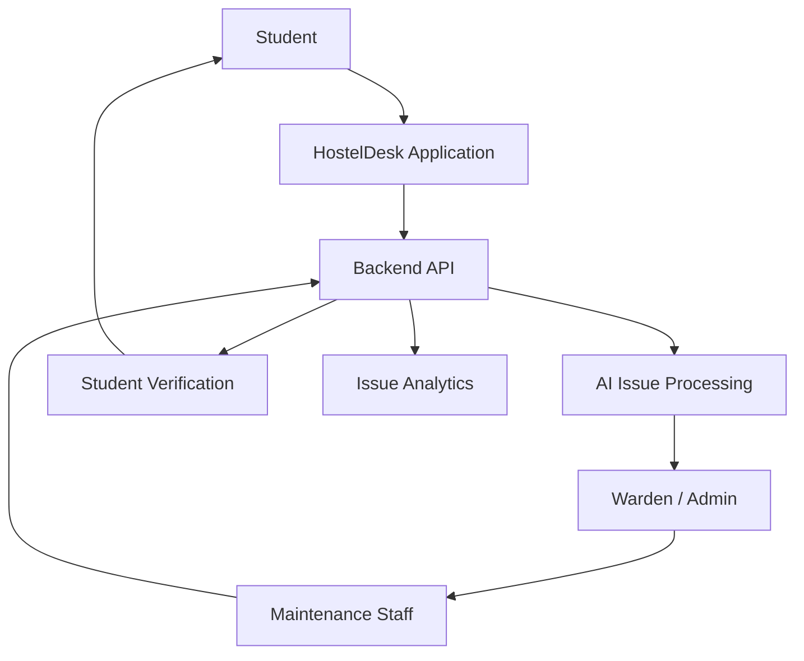

# HostelDesk

**AI-assisted hostel issue management platform for reporting, routing, resolving, and learning from campus maintenance issues.**

HostelDesk connects students, wardens, administrators, and maintenance staff through a structured workflow for handling hostel issues from initial reporting to resolution.

> **REPORT → UNDERSTAND → ROUTE → WORK → VERIFY → RESOLVE → LEARN**

[](https://github.com/adarsh0044321/HostelDesk/releases/tag/v1.0)
[](https://developer.android.com)
[](https://www.oracle.com/java/)
[](https://spring.io/projects/spring-boot)
[](https://www.python.org/)
[](https://fastapi.tiangolo.com/)
[](https://www.postgresql.org/)
[](LICENSE)

---

## 📦 Direct Downloads (v1.0 Release)

Pre-compiled production APK binaries ready for installation on Android 8.0+ devices:

| Application | Target Audience | Package | Download Link |
| :--- | :--- | :--- | :--- |
| **HostelDesk Student** | Resident Students | `com.adarshsingh.hosteldesk` | [📥 Download Student APK (v1.0)](https://github.com/adarsh0044321/HostelDesk/releases/download/v1.0/HostelDesk-Student-v1.0.apk) |
| **HostelDesk Admin** | Wardens, Staff & Directors | `com.adarshsingh.adminhosteldesk` | [📥 Download Admin APK (v1.0)](https://github.com/adarsh0044321/HostelDesk/releases/download/v1.0/HostelDesk-Admin-v1.0.apk) |

*Full changelog and release notes are published in the [Official GitHub Release](https://github.com/adarsh0044321/HostelDesk/releases/tag/v1.0).*

---

## Overview

Hostel maintenance issues are often reported through informal channels such as messages, calls, or verbal communication. This can make it difficult to track requests, assign responsibility, monitor progress, and identify recurring problems.

HostelDesk provides a centralized system where students can report issues and the responsible staff can manage them through a defined workflow.

Where supported by the implementation, AI assists in understanding issue descriptions and organizing information such as category and urgency, while wardens and administrators remain involved in operational decisions.

---

## What HostelDesk Does

A typical issue moves through the following process:

1. **Report** — A student submits a hostel issue using the available input methods.
2. **Understand** — The system processes the report and structures relevant information.
3. **Route** — A warden or administrator reviews and assigns the issue.
4. **Work** — Maintenance staff handle the assigned task.
5. **Verify** — The student can verify the completed work where supported.
6. **Resolve** — The issue is closed after the appropriate workflow is completed.
7. **Learn** — Historical issue data can help identify recurring problems and operational patterns.

---

## Key Features

* Student issue reporting
* Text-based issue descriptions
* Image and/or voice-based reporting where implemented
* AI-assisted issue understanding
* Issue categorization
* Urgency assessment where implemented
* Warden/admin issue management
* Maintenance assignment
* Issue status tracking
* Student resolution verification
* Department/team-based routing where implemented
* Institute-level administration where implemented
* Recurring issue insights and analytics where implemented

---

## User Roles

### Student
Students can report hostel problems, provide relevant information, track their issues, and participate in the resolution workflow.

### Warden / Administrator
Wardens and administrators manage incoming issues, review reports, route work, and oversee the resolution process.

### Maintenance Staff
Maintenance personnel handle assigned work and update the progress of maintenance tasks.

### Institute Administration
The institute administration layer manages institutional users and operational structure where implemented, including relevant student, warden, staff, and department management.

---

## Architecture



The exact architecture and responsibilities of each component are documented according to the current implementation in this repository.

---

## Technology Stack

The project uses the technologies present in the current implementation:

| Layer | Technology | Purpose |
| :--- | :--- | :--- |
| **Frontend / Mobile** | Native Android Java (API 26+, Material 3, Retrofit 2, ViewBinding) | User interface for students and administrators |
| **Backend** | Java 17, Spring Boot 3.2 (Spring Security, Spring Data JPA, Hibernate, Flyway) | Application API and business logic |
| **Database** | PostgreSQL 14+ (hosted on Supabase / AWS, embedded H2 test mode) | Persistent application data |
| **AI** | Python 3.11, FastAPI, Uvicorn, scikit-learn | Issue understanding, categorization, and processing |
| **Authentication** | Stateless JWT (HMAC-SHA256), BCrypt hashing, 4-Factor Executive PIN | User and role authentication |
| **Build / Tooling** | Maven 3.8+ (Backend), Gradle 8.9 (Android), Docker, Git | Development, build automation, and deployment |

---

## Project Structure

```text
HostelDesk/
├── admin-android/               # Native Android Admin & Staff Application (Java)
│   ├── app/src/main/java/       # Activities, Adapters, ViewModels, Retrofit Services
│   └── app/src/main/res/        # Material 3 Layouts, Drawables, Styles, Colors
├── student-android/             # Native Android Student Resident Application (Java)
│   ├── app/src/main/java/       # Resident UI, Attachment Handlers, Rating Dialogs
│   └── app/src/main/res/        # Terracotta Theme, Layouts, Navigation
├── backend/                     # Java Spring Boot 3 Backend Service
│   ├── src/main/java/           # Controllers, Entities, Repositories, Services, Security
│   ├── src/main/resources/      # application.yml, Flyway DB migrations (V1-V6)
│   └── pom.xml                  # Maven Dependencies & Configuration
├── ai-service/                  # Python 3.11 FastAPI AI Classification Microservice
│   ├── classifier.py            # NLP Classification & Priority Recommendation
│   ├── clustering.py            # Recurring Infrastructure Issue Detector
│   ├── main.py                  # FastAPI Endpoints & Health Checks
│   └── requirements.txt         # Python Dependencies
├── database/                    # Reference SQL Schemas and Seed Data
│   ├── schema.sql               # Normalized PostgreSQL DDL Schema
│   └── seed.sql                 # Baseline campus seed data
├── docs/                        # Architecture Diagrams & Screenshots
│   └── screenshots/             # Application UI Previews (Student & Admin)
├── .env.example                 # Environment configuration template
├── .gitignore                   # Repository ignore rules
├── API.md                       # Public REST API Specification
├── ARCHITECTURE.md              # Comprehensive Architecture Specification
├── DATABASE.md                  # Database Schema & Relational Design
├── LICENSE                      # MIT Open Source License
├── README.md                    # Master Project Documentation
├── RELEASE_NOTES.md             # Official v1.0 Launch Notes & Changelog
├── SECURITY.md                  # Security Architecture & Policies
├── SETUP.md                     # Local Development Setup & Build Guide
├── TESTING.md                   # Automated Testing Protocols & QA Guide
├── enable-usb-reverse.bat       # USB reverse port forwarding (Windows Batch)
├── enable-usb-reverse.ps1       # USB reverse port forwarding (PowerShell)
├── install-apks.bat             # Portable ADB APK installer script
├── start-ai.ps1                 # Local AI microservice runner script
├── start-backend.bat            # Local backend runner script (Batch)
└── start-backend.ps1            # Local backend runner script (PowerShell)
```

---

## Getting Started

### Prerequisites

Install the tools required by the project:

* **JDK 17 LTS** (OpenJDK, Eclipse Temurin, or Oracle JDK)
* **Android Studio** (Koala or Jellyfish) with Android SDK 34
* **Python 3.11+** with `pip` and virtual environment support
* **Apache Maven 3.8+**
* **Gradle 8.5+** (or use bundled `./gradlew`)
* **PostgreSQL 14+** (or use built-in H2 profile for zero-config local testing)

### Clone

```bash
git clone https://github.com/adarsh0044321/HostelDesk.git
cd HostelDesk
```

### Environment Configuration

Create the required environment configuration using the provided example:

```bash
cp .env.example .env
```

Configure only the variables required by the project.

Never commit real credentials or API keys.

### Run the Project

Follow the component-specific instructions documented below.

#### Backend

```bash
cd backend

# Option A: Run with local PostgreSQL profile (configure .env or application.yml)
mvn spring-boot:run -Dspring-boot.run.profiles=postgres

# Option B: Run with embedded H2 database (zero-configuration development mode)
mvn spring-boot:run -Dspring-boot.run.profiles=dev
```
Backend starts on port 8080. Health check endpoint: `http://localhost:8080/actuator/health`.

#### Frontend / Mobile

```bash
# Student Application APK
cd student-android
./gradlew assembleDebug

# Admin Application APK
cd ../admin-android
./gradlew assembleDebug
```
*On Windows, use `gradlew.bat assembleDebug`.*

#### AI Service (Optional)

```bash
cd ai-service
python -m venv venv

# Windows:
.\venv\Scripts\activate
# Linux / macOS:
source venv/bin/activate

pip install -r requirements.txt
python -m uvicorn main:app --host 0.0.0.0 --port 8000 --reload
```

---

## Screenshots

Screenshots of the current application are available below:

| HostelDesk Student App | HostelDesk Admin & Staff App |
| :---: | :---: |
|  |  |
| **Student Resident Issue Reporting & Verification** | **Warden Dispatch & Maintenance Workbench** |

---

## Pre-Seeded Test Credentials

The backend includes reference seed accounts for evaluation:

| Organization | Role | Email / ID | Password | 3rd Factor PIN | Scope |
| :--- | :--- | :--- | :--- | :--- | :--- |
| **`JAI`** | **Executive Director** | `adminjai` | `adminjai` | `112233` | Global Institute Administration |
| **`JAI`** | **Warden** | `warden.jai@campus.edu` | `warden123` | — | Residence Operations |
| **`NCH-001`** | **Executive Director** | `admin@campus.edu` | `admin123` | `112233` | Global Institute Administration |
| **`NCH-001`** | **Warden** | `warden.sharma@campus.edu` | `warden123` | — | Dispatch & Verification Queue |
| **`NCH-001`** | **Maintenance Staff** | `suresh@campus.edu` | `staff123` | — | Plumbing Department Tasks |
| **`NCH-001`** | **Student Resident** | `aarav@campus.edu` | `student123` | — | Issue Reporting & Work Approval |

---

## Current Status

HostelDesk is under active development.

The repository contains the currently implemented functionality. Features that are still being developed or planned are listed separately in the roadmap rather than being presented as completed functionality.

## Roadmap

Planned development areas include:

* Improved AI-assisted issue understanding
* More detailed issue analytics
* Recurring issue detection
* Improved routing and assignment workflows
* Notification improvements
* Expanded institute administration
* Production deployment
* Further reliability and performance improvements

The roadmap may change as development continues.

## Security

Do not commit:

* API keys
* Passwords
* Authentication tokens
* Private credentials
* Production secrets
* Private configuration files

Use environment variables for sensitive configuration. See [`SECURITY.md`](SECURITY.md) for project security guidelines.

## Contributing

Contributions and suggestions are welcome.

For development changes:

1. Fork the repository.
2. Create a feature branch.
3. Make your changes.
4. Test the affected functionality.
5. Submit a pull request with a clear description of the change.

## License

See the [`LICENSE`](LICENSE) file for the project's licensing terms.

## Author

**Adarsh Kumar Singh**

Built as an independent software project focused on applying AI and modern application development to practical hostel management problems.
