# HostelDesk 🏢⚡

**AI-assisted hostel issue management platform for reporting, routing, resolving, and learning from campus maintenance issues.**

HostelDesk connects students, wardens, administrators, and maintenance staff through a structured workflow for handling hostel issues from initial reporting to resolution.

> **REPORT → UNDERSTAND → ROUTE → WORK → VERIFY → RESOLVE → LEARN**

[](https://github.com/adarsh0044321/HostelDesk/releases/tag/v1.0)
[](https://developer.android.com)
[](https://www.oracle.com/java/)
[](https://spring.io/projects/spring-boot)
[](https://www.python.org/)
[](https://fastapi.tiangolo.com/)
[](https://www.postgresql.org/)
[](LICENSE)

---

## 📦 Direct Downloads (v1.0 Release)

Pre-compiled production APK binaries configured to run out-of-the-box on Android 8.0+ (API 26+) devices:

| Application | Target Audience | Package Name | APK Download |
| :--- | :--- | :--- | :--- |
| **HostelDesk Student** | Resident Students | `com.adarshsingh.hosteldesk` | [📥 Download Student APK (v1.0)](https://github.com/adarsh0044321/HostelDesk/releases/download/v1.0/HostelDesk-Student-v1.0.apk) |
| **HostelDesk Admin** | Wardens, Staff & Directors | `com.adarshsingh.adminhosteldesk` | [📥 Download Admin APK (v1.0)](https://github.com/adarsh0044321/HostelDesk/releases/download/v1.0/HostelDesk-Admin-v1.0.apk) |

*The complete changelog, release assets, and release verification records are available on the [Official GitHub Releases Page](https://github.com/adarsh0044321/HostelDesk/releases/tag/v1.0).*

---

## 📌 Overview & Problem Statement

Collegiate housing facilities regularly suffer from disorganized maintenance tracking:
* **Informal & Scattered Reporting**: Complaints are submitted through informal WhatsApp messages, paper logbooks, or hallway conversations, leading to lost tickets and lack of audit trails.
* **Operational Disconnect**: Wardens lack real-time visibility into staff workloads, technician response times, and campus infrastructure health.
* **Unverified "Ghost" Repairs**: Work orders are routinely closed by technicians without student confirmation, resulting in recurring breakdowns and resident frustration.
* **No Predictive Learning**: Hostels suffer repeated pipe bursts or electrical failures in the same wings because historical failure patterns are never correlated.

**HostelDesk** replaces these ad-hoc channels with an enterprise-grade, SLA-driven, multi-tenant ecosystem. It unites resident students, wardens, maintenance technicians, and university executive leadership into a single cohesive platform powered by real-time notifications, photographic audit trails, deterministic lifecycle state machines, and intelligent AI issue categorization.

---

## 📸 Application Interface Tour

Real screenshots captured directly from physical Android devices running the live HostelDesk platform:

### 🎓 1. Student Resident Experience

| Dynamic Campus Login | Home & Infrastructure Vitals | AI-Assisted Issue Reporting |
| :---: | :---: | :---: |
| 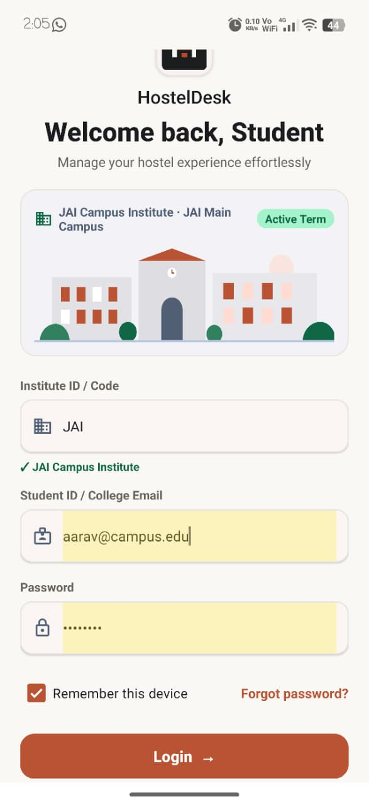 | 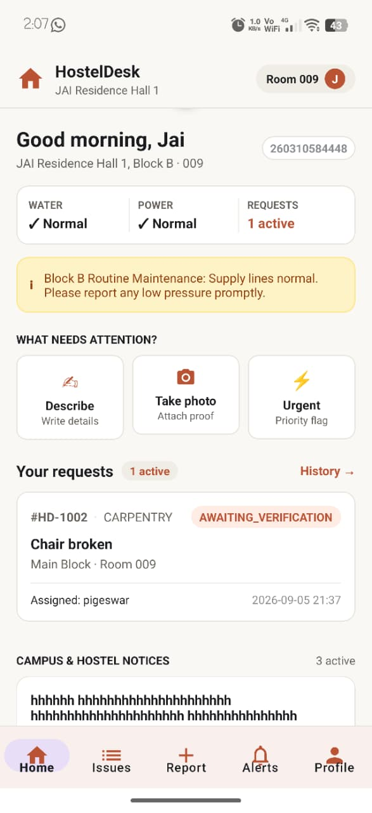 | 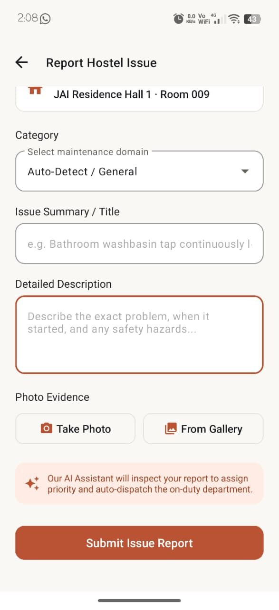 |
| *Tenant resolution & secure auth* | *Water/power status & active requests* | *Real-time NLP triage & photo capture* |

| Issue History & Multi-Status Filters | SLA & Resolution Alerts | Resident Profile & Campus SOS |
| :---: | :---: | :---: |
| 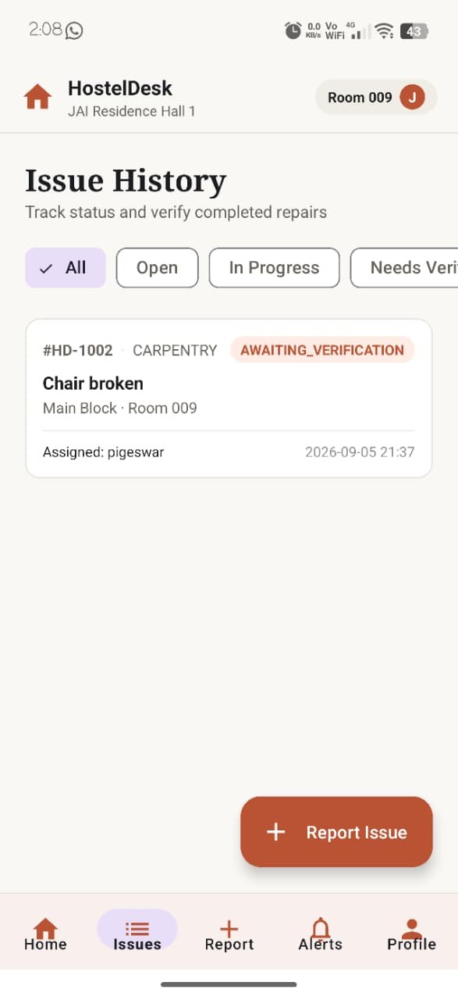 | 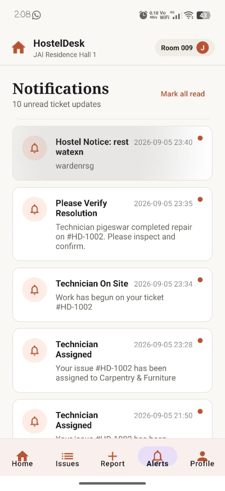 | 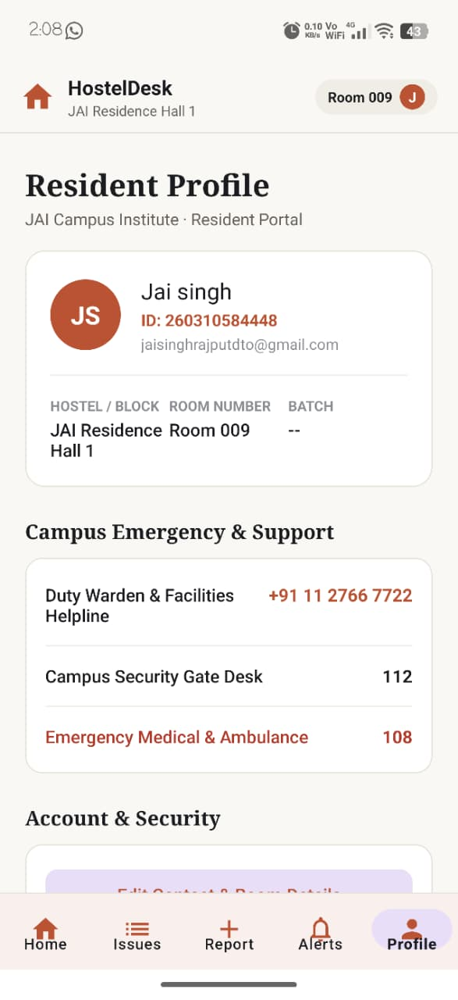 |
| *Status tracking with floating action button* | *Inspection alerts & work milestones* | *Emergency contacts & account settings* |

---

### 🛡️ 2. Warden & Operations Command Center

| Executive Dashboard & Health Pulse | Universal Ticket Management | 7-Department Readiness Matrix |
| :---: | :---: | :---: |
| 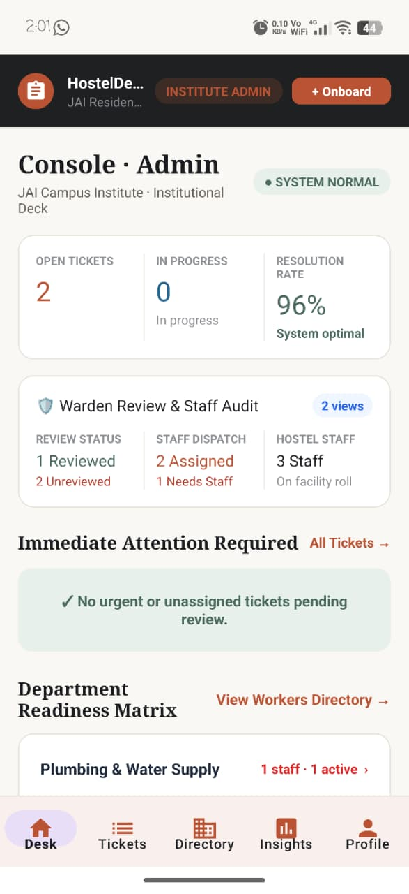 | 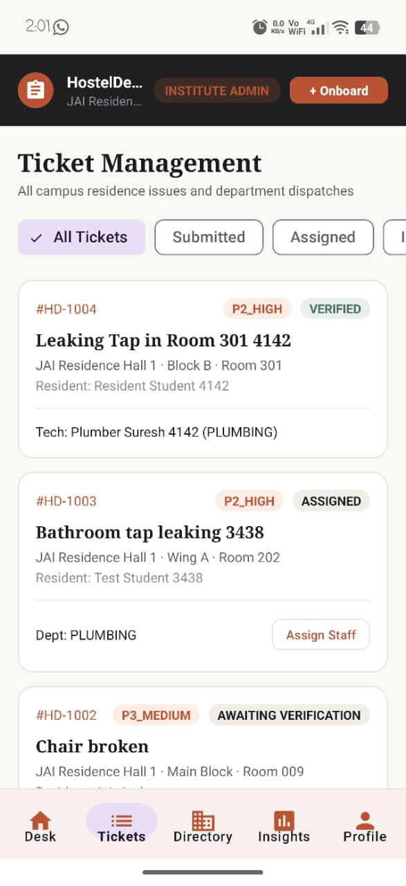 | 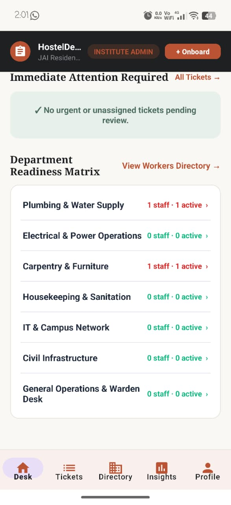 |
| *Live resolution rate & staff audit* | *Multi-status filtering with priority badges* | *Real-time crew readiness & task loads* |

| Technician Dispatch & Triage | Campus Directory & Hall Management | Warden Desk & Notice Board |
| :---: | :---: | :---: |
| 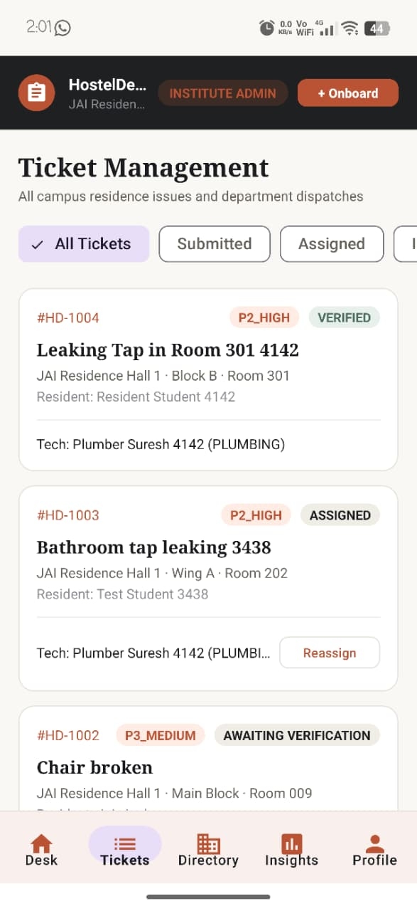 | 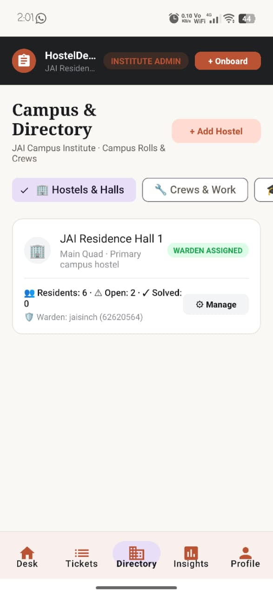 | 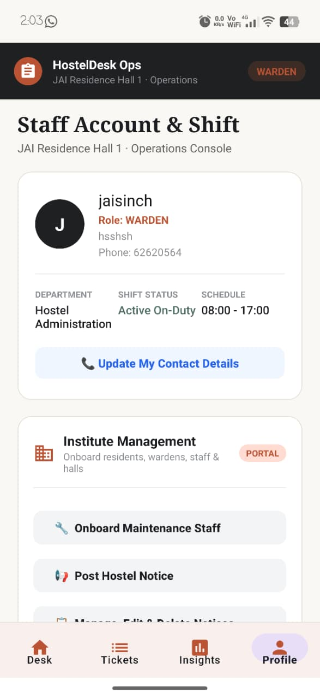 |
| *Technician assignment & SLA escalation* | *Hall capacities, open counts & rosters* | *Warden notices & operational shifts* |

---

## 🔄 Detailed Operational Flowcharts

### 1. End-to-End Operational Lifecycle & Actor Interaction
The following diagram illustrates how an issue travels through all 7 lifecycle stages across students, the AI inference microservice, the Spring Boot gateway, the warden dispatch desk, and maintenance technicians:

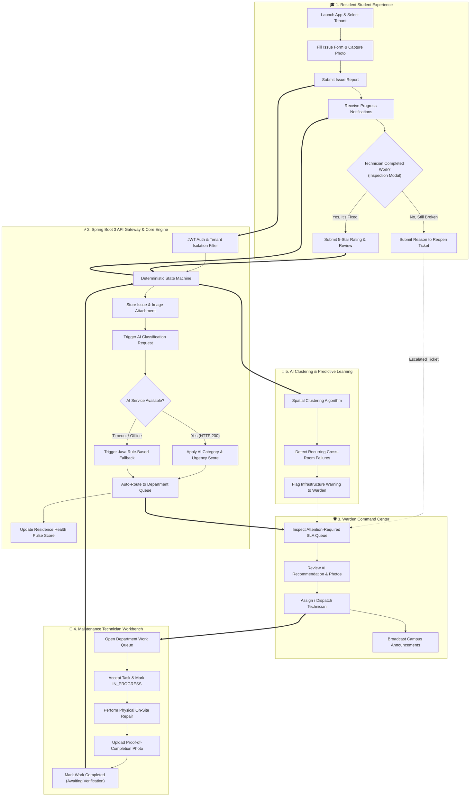

---

### 2. Deterministic State Machine Flowchart
HostelDesk enforces strict, unidirectional state transitions in the database. Tickets cannot skip steps or be unilaterally marked closed without student verification:

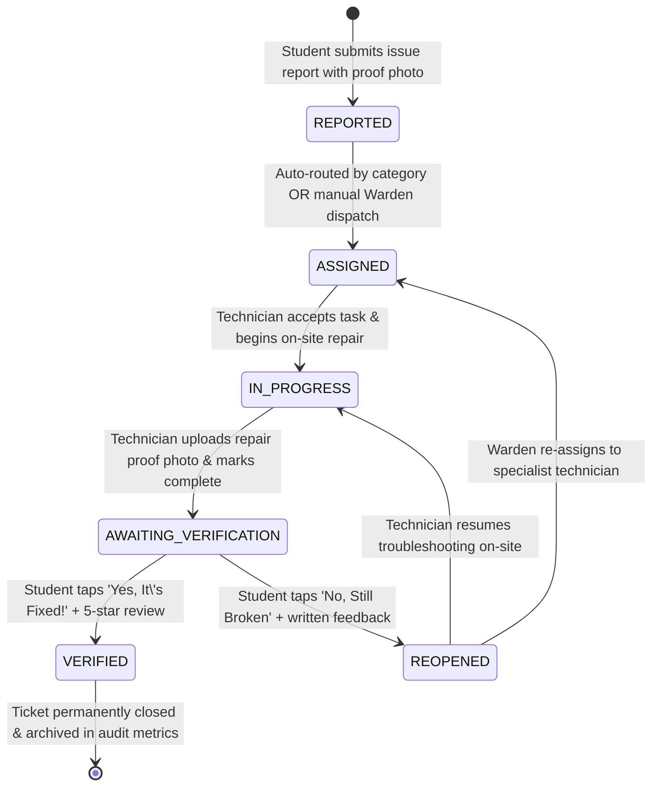

---

### 3. Multi-Tenant 4-Factor Security & Role Boundary Flowchart
To protect administrative operations from student tampering while supporting multi-institution isolation on a shared database:

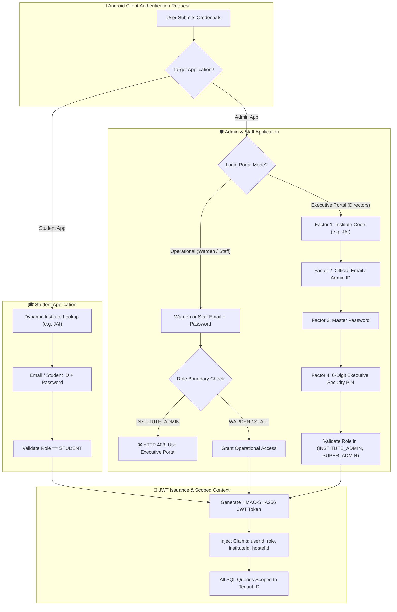

---

## 🏗️ Core Modules & Architectural Features

### 🎓 1. Student Resident Android Application (`student-android`)
- **AI-Assisted Issue Reporting**: Real-time category recommendation, safety hazard alert banners, and priority ratings (`P1_CRITICAL` down to `P4_LOW`).
- **Proof Photo Attachments**: Secure native camera capture via Android `FileProvider` and gallery picker, with memory-safe background downsampling (bounded to 1920px max dimension, 85% JPEG) preventing Out-of-Memory (OOM) crashes.
- **Resolution Verification Loop**:
  - When technicians complete repairs, residents receive an in-app inspection banner.
  - Tapping **"Yes, It's Fixed!"** displays a modal with a 5-star technician rating and review field.
  - Tapping **"No, Still Broken"** prompts for a reason, transitioning the ticket to `REOPENED` and alerting the warden.
- **Campus SOS & Helpline**: One-touch dialer (`Intent.ACTION_DIAL`) for Duty Warden, Campus Security (112), and Emergency Medical (108).
- **Material 3 Design**: Fully custom terracotta palette (`#BA5333`), 48dp minimum touch targets, zero text truncation, and responsive empty/loading/error states.

### 🛡️ 2. Warden & Operations Command Center (`admin-android`)
- **Residence Health Pulse**: Algorithmic score calculated in real-time from open critical tickets, average resolution speed, and student satisfaction ratings.
- **7-Department Readiness Matrix**: Live technician availability and active work volume across `PLUMBING`, `ELECTRICAL`, `CARPENTRY`, `CLEANING`, `INTERNET`, `CIVIL`, and `GENERAL`.
- **Attention-Required SLA Queue**: Prioritizes unassigned issues and escalated `REOPENED` tickets with color-coded countdown indicators.
- **Warden Notice Board**: Create, edit, and delete campus-wide or block-specific broadcast announcements.
- **Technician Task Workbench**: Dedicated interface for maintenance staff with task stages (`Assigned`, `In Progress`, `Completed`) and completion photo uploads.
- **4-Factor Executive Portal**: Isolated login requiring **Institute Code**, **Official ID**, **Password**, and a **6-digit Executive Security PIN**.

### ⚡ 3. Java Spring Boot 3 Modular Backend (`backend`)
- **Strict Multi-Tenant Isolation**: Shared-schema architecture isolating colleges, campuses, hostels, rooms, students, and staff via foreign keys and server-side query scoping.
- **Deterministic State Machine**: Enforces legal state progression (`REPORTED` → `ASSIGNED` → `IN_PROGRESS` → `AWAITING_VERIFICATION` → `VERIFIED`).
- **Circuit-Breaker AI Fallback**: If the Python AI microservice is slow or offline (>3s timeout), a deterministic rule-based classifier handles the submission with zero user disruption.
- **Database Migrations (Flyway)**: Version-controlled schema migrations (`V1` through `V6`) managing relational integrity, indexes, and seed datasets.
- **Dual Persistence Profiles**: Seamless switching between PostgreSQL (for production/cloud) and embedded PostgreSQL-compatible H2 (for offline testing).

### 🤖 4. Python FastAPI AI Microservice (`ai-service`)
- **NLP Categorization**: High-speed classification model trained to map natural language complaint descriptions to maintenance departments.
- **Urgency Scoring**: Detects emergency keywords (e.g. "sparking wire", "flooding", "broken lock", "gas leak") to assign `P1_CRITICAL` urgency.
- **Spatial Pattern Clustering**: Correlates complaint categories across physical rooms and floors to detect recurring structural defects before catastrophic failure.

---

## 🛠️ Complete REST API Directory

| Method | Endpoint | Access Role | Description |
| :--- | :--- | :--- | :--- |
| `POST` | `/api/auth/login` | Public | Authenticates student, warden, or staff with JWT issuance |
| `POST` | `/api/auth/executive-login` | Executive Admin | 4-Factor authentication with institute code & security PIN |
| `GET` | `/api/auth/institutes/{code}` | Public | Resolves tenant metadata and active status dynamically |
| `GET` | `/api/auth/me` | Authenticated | Retrieves current authenticated user profile and roles |
| `GET` | `/api/student/dashboard` | `STUDENT` | Fetches student vitals (water/power), active count, announcements |
| `POST` | `/api/student/issues` | `STUDENT` | Submits new issue with category, description, and photo upload |
| `GET` | `/api/student/issues` | `STUDENT` | Lists student's personal reported issues with status filter |
| `POST` | `/api/student/issues/{id}/verify` | `STUDENT` | Confirms resolution with 5-star rating & closes ticket |
| `POST` | `/api/student/issues/{id}/reopen` | `STUDENT` | Reopens unsatisfied repair with written feedback |
| `GET` | `/api/student/notifications` | `STUDENT` | Returns real-time milestone and verification alerts |
| `GET` | `/api/admin/console` | `WARDEN`, `ADMIN` | Returns Health Pulse, attention queue, and readiness matrix |
| `GET` | `/api/admin/tickets` | `WARDEN`, `ADMIN` | Multi-status ticket management and search |
| `POST` | `/api/admin/tickets/{id}/assign` | `WARDEN`, `ADMIN` | Dispatches issue to specific department or maintenance staff |
| `POST` | `/api/admin/notices` | `WARDEN`, `ADMIN` | Publishes hostel notice or emergency alert |
| `DELETE` | `/api/admin/notices/{id}` | `WARDEN`, `ADMIN` | Deletes published notice |
| `GET` | `/api/staff/queue` | `MAINTENANCE_STAFF` | Fetches department work queue and assigned tasks |
| `POST` | `/api/staff/tickets/{id}/start` | `MAINTENANCE_STAFF` | Transitions ticket from `ASSIGNED` to `IN_PROGRESS` |
| `POST` | `/api/staff/tickets/{id}/complete` | `MAINTENANCE_STAFF` | Uploads proof photo and moves ticket to `AWAITING_VERIFICATION` |
| `POST` | `/predict` | Internal AI Service | Returns category prediction and priority score from issue text |

---

## 💻 Technology Stack Reference

| Layer | Technology | Purpose |
| :--- | :--- | :--- |
| **Frontend / Mobile** | Native Android (Java 17, SDK 34, Material 3, Retrofit 2, ViewBinding, OkHttp 4) | High-performance resident & admin user interfaces |
| **Backend Framework** | Java 17, Spring Boot 3.2.3 (Spring Security 6, Spring Data JPA, Hibernate) | Modular monolith API gateway, validation, business logic |
| **Database** | PostgreSQL 14+ (hosted on Supabase / AWS, embedded H2 fallback) | Persistent multi-tenant relational application storage |
| **Database Migration** | Flyway 9.22 | Versioned DDL migration scripts (`V1` to `V6`) |
| **AI Microservice** | Python 3.11, FastAPI 0.110, Uvicorn, scikit-learn | NLP category prediction, urgency scoring, cluster analysis |
| **Security & Auth** | Stateless JWT (HMAC-SHA256), BCrypt (salt 12), 4-Factor Executive PIN | Multi-tenant authentication and role-based endpoint guards |
| **Build & Tooling** | Maven 3.8+ (Backend), Gradle 8.9 (Android), Docker | Build automation, dependency management, and containerization |

---

## 📂 Verified Project Structure

```text
HostelDesk/
├── admin-android/               # Native Android Admin & Staff Application (Java)
│   ├── app/src/main/java/       # Activities, Adapters, ViewModels, Retrofit Services
│   │   └── com/adarshsingh/adminhosteldesk/
│   │       ├── data/api/        # Retrofit API interfaces & Auth interceptors
│   │       ├── data/model/      # Request/Response DTOs & Domain models
│   │       └── ui/              # Console, Ticket Management, Directory, Profile
│   └── app/src/main/res/        # Material 3 Layouts, Drawables, Styles, Colors
├── student-android/             # Native Android Student Resident Application (Java)
│   ├── app/src/main/java/       # Resident UI, Attachment Handlers, Rating Dialogs
│   │   └── com/adarshsingh/hosteldesk/
│   │       ├── data/api/        # ApiClient & ApiService interfaces
│   │       ├── data/local/      # SessionManager (JWT & tenant caching)
│   │       └── ui/              # Dashboard, Report Issue, History, Alerts, Profile
│   └── app/src/main/res/        # Terracotta Theme, Layouts, Navigation
├── backend/                     # Java Spring Boot 3 Backend Service
│   ├── src/main/java/           # Controllers, Entities, Repositories, Services, Security
│   ├── src/main/resources/      # application.yml, Flyway DB migrations (V1-V6)
│   ├── src/test/java/           # 16 Unit & Integration Test Suites
│   ├── pom.xml                  # Maven Dependencies & Configuration
│   ├── mvnw.cmd                 # Portable Maven Wrapper
│   ├── run.bat                  # Portable Backend Startup Script (Batch)
│   └── run.ps1                  # Portable Backend Startup Script (PowerShell)
├── ai-service/                  # Python 3.11 FastAPI AI Classification Microservice
│   ├── classifier.py            # NLP Classification & Priority Recommendation
│   ├── clustering.py            # Recurring Infrastructure Issue Detector
│   ├── main.py                  # FastAPI Endpoints & Health Checks
│   ├── requirements.txt         # Python Dependencies
│   └── tests/                   # Pytest Test Suite
├── database/                    # Reference SQL Schemas and Seed Data
│   ├── schema.sql               # Normalized PostgreSQL DDL Schema
│   └── seed.sql                 # Baseline campus seed data
├── docs/                        # Architecture Diagrams & Screenshots
│   └── screenshots/             # 13 Verified Mobile Application Screenshots
├── .env.example                 # Environment configuration template
├── .gitignore                   # Comprehensive repository ignore rules
├── API.md                       # Public REST API Specification
├── ARCHITECTURE.md              # Comprehensive Architecture Specification
├── DATABASE.md                  # Database Schema & Relational Design
├── LICENSE                      # MIT Open Source License
├── README.md                    # Master Project Documentation
├── RELEASE_NOTES.md             # Official v1.0 Launch Notes & Changelog
├── SECURITY.md                  # Security Architecture & Policies
├── SETUP.md                     # Local Development Setup & Build Guide
├── TESTING.md                   # Automated Testing Protocols & QA Guide
├── enable-usb-reverse.bat       # USB reverse port forwarding (Windows Batch)
├── enable-usb-reverse.ps1       # USB reverse port forwarding (PowerShell)
├── install-apks.bat             # Portable ADB APK installer script
├── start-ai.ps1                 # Local AI microservice runner script
├── start-backend.bat            # Local backend runner script (Batch)
└── start-backend.ps1            # Local backend runner script (PowerShell)
```

---

## 🚀 Getting Started & Local Development

### Prerequisites
* **JDK 17 LTS** (OpenJDK, Eclipse Temurin, or Oracle JDK)
* **Android Studio** (Koala or Jellyfish) with Android SDK 34
* **Python 3.11+** with `pip` and virtual environment support
* **Apache Maven 3.8+**
* **Gradle 8.5+** (or use bundled `./gradlew`)
* **PostgreSQL 14+** (or use the built-in embedded H2 profile for zero-config testing)

### 1. Clone & Environment Setup
```bash
git clone https://github.com/adarsh0044321/HostelDesk.git
cd HostelDesk

# Copy the environment configuration template:
cp .env.example .env
```
*Configure `.env` with your database credentials and preferred active profile (`postgres` or `dev`).*

---

### 2. Run the Python AI Microservice (Local)
```bash
cd ai-service
python -m venv venv

# On Windows:
.\venv\Scripts\activate
# On Linux / macOS:
source venv/bin/activate

pip install -r requirements.txt
python -m uvicorn main:app --host 0.0.0.0 --port 8000 --reload
```
*Service runs at `http://localhost:8000`. Interactive documentation at `/docs`.*

---

### 3. Run the Spring Boot Backend (Local)
```bash
cd backend

# Option A: Run with local PostgreSQL (configured via .env or application.yml)
mvn spring-boot:run -Dspring-boot.run.profiles=postgres

# Option B: Run with embedded H2 PostgreSQL-compatible database (zero setup required)
mvn spring-boot:run -Dspring-boot.run.profiles=dev
```
*Backend runs on port 8080. Health check endpoint at `http://localhost:8080/actuator/health`.*

---

### 4. Build Android Applications
```bash
# Student Application APK
cd student-android
./gradlew assembleDebug

# Admin & Staff Application APK
cd ../admin-android
./gradlew assembleDebug
```
*Generated APKs will be located in `<app-dir>/app/build/outputs/apk/debug/app-debug.apk`.*

---

### 5. Testing on Physical Android Hardware (over USB)
To test physical Android devices against your local workstation:
1. Connect your phone via USB with **USB Debugging** enabled.
2. Run the reverse port-forwarding utility:
   ```cmd
   enable-usb-reverse.bat
   ```
3. Your phone can now directly reach the local backend at `http://127.0.0.1:8080`.

---

## 🔑 Pre-Seeded Live Credentials

The backend includes verified seed accounts ready for evaluation:

| Organization | Role | Email / ID | Password | 3rd Factor PIN | Scope & Responsibilities |
| :--- | :--- | :--- | :--- | :--- | :--- |
| **`JAI`** | **Executive Director** | `adminjai` | `adminjai` | `112233` | Global Administration & Onboarding |
| **`JAI`** | **Warden** | `warden.jai@campus.edu` | `warden123` | — | JAI Residence Hall Operations |
| **`NCH-001`** | **Executive Director** | `admin@campus.edu` | `admin123` | `112233` | North Campus Global Administration |
| **`NCH-001`** | **Warden** | `warden.sharma@campus.edu` | `warden123` | — | Tagore & Shastri Hall Operations |
| **`NCH-001`** | **Maintenance Staff** | `suresh@campus.edu` | `staff123` | — | Plumbing Department Tasks |
| **`NCH-001`** | **Student Resident** | `aarav@campus.edu` | `student123` | — | Room 204, Tagore Hall |

---

## 🧪 Automated Testing & Verification

HostelDesk includes comprehensive test suites across both backend and AI layers:

### Backend Automated Test Suite
```bash
cd backend
mvn clean test
```
*Result: **16/16 tests passing** (0 failures, 0 errors). Tests verify multi-tenant isolation, state machine transitions, circuit-breaker AI fallback, JWT generation, and role security.*

### Python AI Test Suite
```bash
cd ai-service
python -m pytest
```
*Result: **4/4 tests passing**. Tests verify NLP department classification, emergency priority scoring, and room cluster detection.*

---

## 🗺️ Roadmap

Planned development areas for upcoming releases include:
* **Voice-Based Issue Reporting**: Native speech-to-text recording for rapid complaint submission.
* **Predictive Preventive Maintenance**: Automated work order generation when sensor or cluster thresholds are exceeded.
* **Push Notification Service**: Direct Firebase Cloud Messaging (FCM) integration for real-time mobile push notifications.
* **Campus Inventory & Asset Management**: Tracking spare parts and repair supplies directly from the technician workbench.
* **Digital Out-Pass & Leave Management**: Integrated hostel exit/entry pass approval system for wardens and students.

---

## 🔒 Security

HostelDesk follows defense-in-depth security principles:
* Passwords hashed using **BCrypt** (salt strength 12).
* Stateless **JWT authentication** with strict role validation (`@PreAuthorize`).
* Role boundary protection preventing students from authenticating against administrative endpoints.
* File upload validation enforcing image MIME types and UUID-based file storage outside the web root.
* **Zero Credential Leaks**: Sensitive configurations are managed strictly via environment variables.

See [`SECURITY.md`](SECURITY.md) for full security specifications.

---

## 🤝 Contributing

Contributions and suggestions are welcome:
1. Fork the repository.
2. Create your feature branch (`git checkout -b feature/improvement`).
3. Commit your changes (`git commit -m "feat: add support for voice reporting"`).
4. Run all tests to verify stability (`mvn test`, `python -m pytest`).
5. Push to the branch (`git push origin feature/improvement`).
6. Open a Pull Request with a clear explanation of changes.

---

## 📄 License

Distributed under the **MIT License**. See [`LICENSE`](LICENSE) for complete terms.

---

## 👨‍💻 Author

**Adarsh Kumar Singh**  
*Built as an independent software project focused on applying AI and modern application development to practical hostel management problems.*
